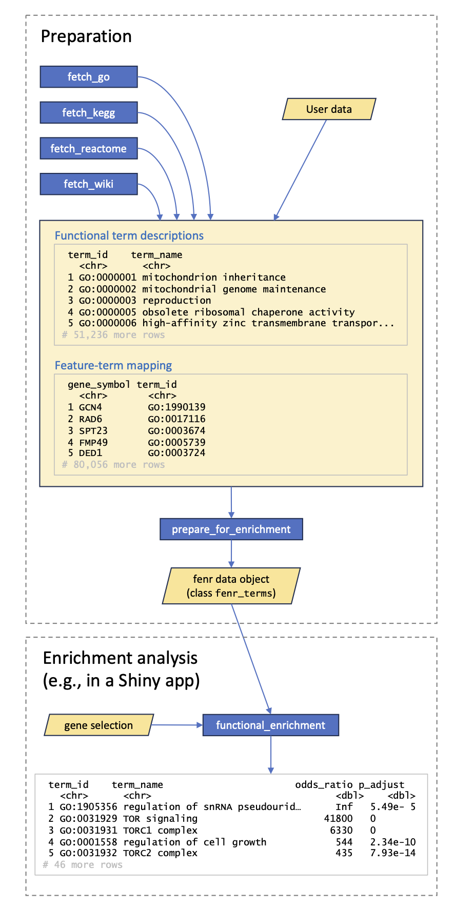

```{r setup, include = FALSE}
knitr::opts_chunk$set(
  collapse = TRUE,
  comment = "#>"
)
options(width = 72)
```


# Purpose

Functional enrichment analysis determines if specific biological functions or pathways are overrepresented in a set of features (e.g., genes, proteins). These sets often originate from differential expression analysis, while the functions and pathways are derived from databases such as *GO*, *Reactome*, or *KEGG*. In its simplest form, enrichment analysis employs Fisher's test to evaluate if a given function is enriched in the selection. The null hypothesis asserts that the proportion of features annotated with that function is the same between selected and non-selected features.

Functional enrichment analysis requires downloading large datasets from the aforementioned databases before conducting the actual analysis. While downloading data is time-consuming, Fisher's test can be performed rapidly. This package aims to separate these two steps, enabling fast enrichment analysis for various feature selections using a given database. It is specifically designed for interactive applications like Shiny. A small Shiny app, included in the package, demonstrates the usage of *fenr*.

## Caveats

Functional enrichment analysis should not be considered the ultimate answer in understanding biological systems. In many instances, it may not provide clear insights into biology. Specifically, when arbitrary groups of genes are selected, enrichment analysis only reveals the statistical overrepresentation of a functional term within the selection, which may not directly correspond to biological relevance. This package serves as a tool for data exploration; any conclusions drawn about biology require independent validation and further investigation.

# Installation

*fenr* can be installed from *Bioconductor* by using:

```{r bioconductor_install, eval=FALSE}
if (!require("BiocManager", quietly = TRUE))
    install.packages("BiocManager")

BiocManager::install("fenr")
```

# Overview

The input data for *fenr* consists of two tibbles or data frames (see figure below). One tibble contains functional term descriptions, while the other provides the term-to-feature mapping. Users can acquire these datasets using the convenient helper functions like `fetch_*`, which facilitate data retrieval from GO, KEGG, or WikiPathways. Alternatively, users have the option to provide their own datasets. These tibbles are subsequently transformed into a fenr_terms object, specifically designed for efficient data retrieval and access. The resulting object is then employed by the functional_enrichment function to perform enrichment analysis for any chosen feature selection.

```{r figure, fig.cap="Overview of fenr data pipeline.", echo=FALSE}

```

# Example

Package *fenr* and example data are loaded with the following commands:

```{r load_fenr}
library(fenr)
data(exmpl_all, exmpl_sel)
```

## Data preparation

The initial step involves downloading functional term data. *fenr* supports data downloads from *Gene Ontology*, *Reactome*, *KEGG*, and *WikiPathways*. Custom ontologies can also be used, provided they are converted into an appropriate format (refer to the `prepare_for_enrichment` function for more information). The command below downloads functional terms and gene mapping from Gene Ontology (GO):

```{r fetch_go}
go <- fetch_go(species = "sgd")
```

`sgd` is a designation for yeast in Gene Ontology. The full list of available species designations can be obtain using the command:

```{r species}
go_species <- fetch_go_species()
go_species
```

`go` is a list with two tibbles. The first tibble contains term information:

```{r go_terms}
go$terms
```

The second tibble contains gene-term mapping:

```{r go_mapping}
go$mapping
```

To make these user-friendly data more suitable for rapid functional enrichment analysis, they need to be converted into a machine-friendly object using the following function:

```{r prepare_for_enrichment}
go_terms <- prepare_for_enrichment(go$terms, go$mapping, exmpl_all,
                                   feature_name = "gene_symbol")
```

`exmpl_all` is an example of gene background - a vector with gene symbols related to all detections in an imaginary RNA-seq experiment. Since different datasets use different features (gene id, gene symbol, protein id), the column name containing features in `go$mapping` needs to be specified using `feature_name = "gene_symbol"`. The resulting object, `go_terms`, is a data structure containing all the mappings in a quickly accessible form. From this point on, `go_terms` can be employed to perform multiple functional enrichment analyses on various gene selections.

## Functional enrichment

The package includes two pre-defined gene sets. `exmpl_all` contains all background gene symbols, while `exmpl_sel` comprises the genes of interest. To perform functional enrichment analysis on the selected genes, you can use the following single, efficient function call:

```{r enrichment}
enr <- functional_enrichment(exmpl_all, exmpl_sel, go_terms)
```

## The output

The result of `functional_enrichment` is a tibble with enrichment results.

```{r enrichment_result}
enr |>
  head(10)
```

The columns are as follows

 - `N_with`: The number of features (genes) associated with this term in the background of all genes.
 - `n_with_sel`: The number of features associated with this term in the selection.
 - `n_expect`: The expected number of features associated with this term under the null hypothesis (terms are randomly distributed).
 - `enrichment`: The ratio of observed to expected.
 - `odds_ratio`: The effect size, represented by the odds ratio from the contingency table.
 - `ids`: The identifiers of features with the term in the selection.
 - `p_value`: The raw p-value from the hypergeometric distribution.
 - `p_adjust`: The p-value adjusted for multiple tests using the Benjamini-Hochberg approach.

# Interactive Example

A small Shiny app is included in the package to demonstrate the usage of *fenr* in an interactive environment. All time-consuming data loading and preparation tasks are performed before the app is launched.

```{r interactive_prepare}
data(yeast_de)
term_data <- fetch_terms_for_example(yeast_de)
```
 
`yeast_de` is the result of differential expression (using `edgeR`) on a subset of 6+6 replicates from [Gierlinski et al. (2015)](https://academic.oup.com/bioinformatics/article/31/22/3625/240923).

The function `fetch_terms_for_example` uses `fetch_*` functions from *fenr* to download and process data from *GO*, *Reactome* and *KEGG*. The step-by-step process of data acquisition can be examined by viewing the function by typing `fetch_terms_for_example` in the R console. The object `term_data` is a named list of `fenr_terms` objects, one for each ontology.

After completing the slow tasks, you can start the Shiny app by running:

```{r shiny_app, eval=FALSE}
enrichment_interactive(yeast_de, term_data)
```

To quickly see how *fenr* works an example can be loaded directly from GitHub:

```
shiny::runGitHub("bartongroup/fenr-shiny-example")
```

# Comparison to other functional enrichment packages

There's no shortage of R packages dedicated to functional enrichment analyses, including *topGO*, *GOstats*, *clusterProfiler*, and *GOfuncR*. Many of these packages provide comprehensive analyses tailored to a single gene selection. While they offer detailed insights, their extensive computational requirements often render them slower.

In exploratory data analysis, one often conducts several enrichment analyses. This might involve assessing genes that exhibit both upward and downward shifts across diverse condition pairs, while also taking into account various significance levels and fold change thresholds. Even though the underlying dataset remains the same, different gene selections come into play. To illustrate, let's take the example of the *topGO* package. 


```{r topGO}
suppressPackageStartupMessages({
  library(topGO)
})

# Preparing the gene set
all_genes <- setNames(rep(0, length(exmpl_all)), exmpl_all)
all_genes[exmpl_all %in% exmpl_sel] <- 1

# Define the gene selection function
gene_selection <- function(genes) {
  genes > 0
}

# Mapping genes to GO, we use the go2gene downloaded above and convert it to a
# list
go2gene <- go$mapping |> 
  dplyr::select(gene_symbol, term_id) |> 
  dplyr::distinct() |> 
  dplyr::group_by(term_id) |> 
  dplyr::summarise(ids = list(gene_symbol)) |> 
  tibble::deframe()

# Setting up the GO data for analysis
go_data <- new(
  "topGOdata",
  ontology = "BP",
  allGenes = all_genes,
  geneSel = gene_selection,
  annot = annFUN.GO2genes,
  GO2genes = go2gene
)

# Performing the enrichment test
fisher_test <- runTest(go_data, algorithm = "classic", statistic = "fisher")
```

Though the enrichment test (`runTest`) is fairly fast, completing in about 200 ms on an Intel Core i7 processor, the preparatory step (`new` call) demands a more substantial time commitment, around 6 seconds. Considering each additional gene selection requires a similar amount of time, conducting exploratory interactive analyses on multiple gene sets becomes notably cumbersome.

*fenr* separates preparatory steps and gene selection and is designed with interactivity and speed in mind, particularly when users wish to execute rapid, multiple selection tests.

```{r fenr_speed}
# Setting up data for enrichment
go <- fetch_go(species = "sgd")
go_terms <- prepare_for_enrichment(go$terms, go$mapping, exmpl_all,
                                   feature_name = "gene_symbol")

# Executing the enrichment test
enr <- functional_enrichment(exmpl_all, exmpl_sel, go_terms)
```

While data preparation with *fenr* might take a bit longer (around 10 s), the enrichment test is fast, finishing in just about 50 ms. Each new gene selection takes a similar amount of time (with an obvious caveat that a larger gene selection would take more time to calculate).


# Session info {.unnumbered}

```{r session_info, echo=FALSE}
sessionInfo()
```
